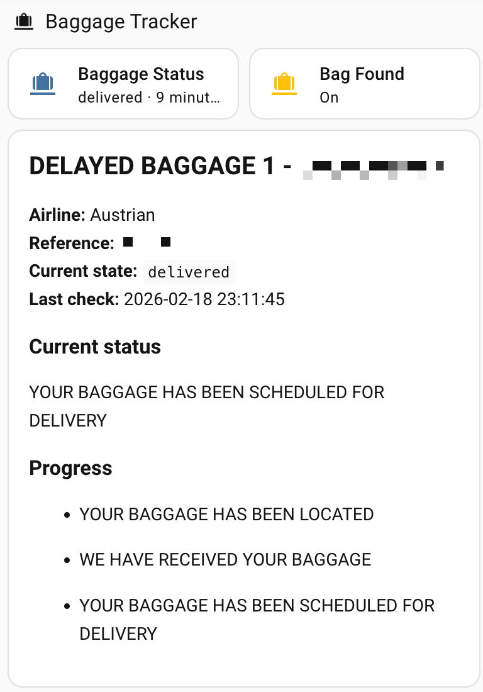
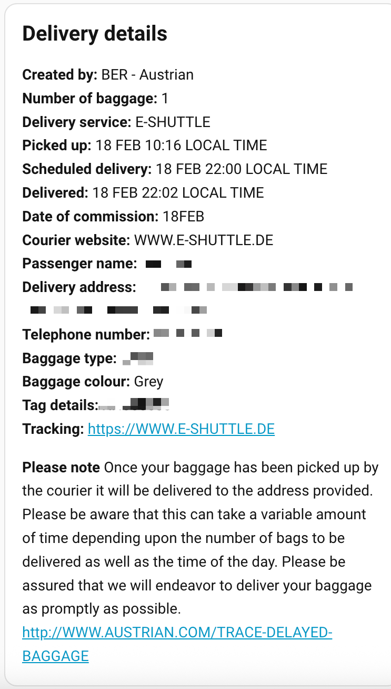

# Mybag.aero Baggage Tracker

Home Assistant custom integration for tracking delayed baggage status from mybag.aero.

Supported airlines:
- Austrian
- Lufthansa
- Swiss

## What you get
For each configured baggage file, the integration creates:
- `sensor.<name>_status`
- `binary_sensor.<name>_found`

`sensor` state values:
- `searching`
- `located`
- `received`
- `scheduled_for_delivery`
- `delivered`
- `not_found`
- `error`

Useful sensor attributes:
- `airline`
- `reference_number`
- `family_name`
- `bag_title`
- `headline`
- `details`
- `tracing_statuses`
- `primary_tracing_status`
- `status_steps`
- `current_status_text`
- `status_body`
- `delivery_details`
- `no_of_bags_updated`
- `record_status`
- `message`
- `checked_at`
- `source_url`
- `raw_excerpt`

## Limitations
- Multi-bag delayed baggage reports (more than one luggage piece in one report) are not tested.
- It may work, but behavior is currently unknown because no suitable sample data was available for testing.

## Install (End User, via HACS)
1. Open Home Assistant.
2. Go to `HACS -> Integrations -> Custom repositories`.
3. Add this repository URL as type `Integration`:
   - `https://github.com/thomasgregg/mybag.aero-home-assistant-baggage-tracker`
4. Install `Mybag.aero Baggage Tracker` from HACS.
5. Restart Home Assistant.
6. Go to `Settings -> Devices & Services -> Add Integration`.
7. Search for `Mybag.aero Baggage Tracker`.
8. Enter:
   - Airline (`austrian`, `lufthansa`, `swiss`)
   - Reference number in file-reference format (for example `ABCOS12345`)
   - Family name
   - Scan interval in minutes

## Dashboard UI Example
You can paste this as a manual Lovelace card (`type: vertical-stack`) and adapt entity IDs to your setup.




```yaml
type: vertical-stack
cards:
  - type: grid
    columns: 2
    square: false
    cards:
      - type: tile
        entity: sensor.mybag_beros22525_status
        name: Baggage Status
        icon: mdi:bag-checked
        state_content:
          - state
          - last_updated
        vertical: false
        features_position: bottom
      - type: tile
        entity: binary_sensor.mybag_beros22525_found
        name: Bag Found
        icon: mdi:bag-checked
        state_content:
          - state
  - type: markdown
    content: >
      

      

      

      

      

      

      

      

      


      

      

      


      ## {{ bag_title if bag_title else 'Delayed Baggage' }}


      **Airline:** {{ airline|title }}  

      **Reference:** {{ ref }}  

      **Current state:** `{{ s }}`  

      **Last check:** {{ as_timestamp(checked) |
      timestamp_custom('%Y-%m-%d %H:%M:%S') }}


      


      ### Current status


      {{ current }}


      


      


      {{ body }}


      


      


      ### Progress


      


      - {{ step }}


      


      
  - type: conditional
    conditions:
      - condition: state
        entity: sensor.mybag_beros22525_status
        state_not: searching
      - condition: state
        entity: sensor.mybag_beros22525_status
        state_not: not_found
      - condition: state
        entity: sensor.mybag_beros22525_status
        state_not: error
    card:
      type: markdown
      content: >-
        

        ## Delivery details

        **Created by:** {{ d.get('created_by') }}

        **Number of baggage:** {{
        d.get('number_of_baggage_in_delivery') }}

        **Delivery service:** {{
        d.get('delivery_service') }}

        **Picked up:** {{
        d.get('pickup_datetime_local') }}

        **Scheduled delivery:** {{
        d.get('scheduled_delivery_local') }}

        **Delivered:** {{
        d.get('delivered_datetime_local') }}

        **Date of commission:** {{
        d.get('commission_date') }}

        **Courier website:** {{
        d.get('courier_website') }}

        **Passenger name:** {{
        d.get('passenger_name') }}

        **Delivery address:** {{
        d.get('delivery_address') }}

        **Telephone number:** {{
        d.get('telephone_number') }}

        **Baggage type:** {{ d.get('baggage_type')
        }}

        **Baggage colour:** {{
        d.get('baggage_colour') }}

        **Tag details:** {{ d.get('tag_details')
        }}

        **Tracking:** [{{
        d.get('courier_tracking_url') }}]({{ d.get('courier_tracking_url') }})


        

        **Please note**  
        
        {{ note_text }}

        
```
