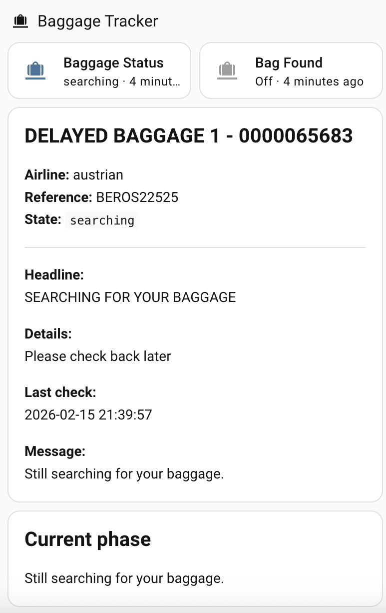

# Mybag.aero Baggage Tracker

Home Assistant custom integration for tracking delayed baggage status from mybag.aero.

Supported airlines:
- Austrian
- Lufthansa
- Swiss

## What you get
For each configured baggage file, the integration creates:
- `sensor.<name>_status`
- `binary_sensor.<name>_found`

`sensor` state values:
- `searching`
- `updated`
- `not_found`
- `error`

Useful sensor attributes:
- `airline`
- `reference_number`
- `family_name`
- `bag_title`
- `headline`
- `details`
- `tracing_statuses`
- `no_of_bags_updated`
- `record_status`
- `message`
- `is_searching`
- `checked_at`
- `source_url`

## Install (End User, via HACS)
1. Open Home Assistant.
2. Go to `HACS -> Integrations -> Custom repositories`.
3. Add this repository URL as type `Integration`:
   - `https://github.com/thomasgregg/mybag.aero-home-assistant-baggage-tracker`
4. Install `Mybag.aero Baggage Tracker` from HACS.
5. Restart Home Assistant.
6. Go to `Settings -> Devices & Services -> Add Integration`.
7. Search for `Mybag.aero Baggage Tracker`.
8. Enter:
   - Airline (`austrian`, `lufthansa`, `swiss`)
   - Reference number in file-reference format (for example `ABCOS12345`)
   - Family name
   - Scan interval in minutes

## Dashboard UI Example
You can paste this as a manual Lovelace card (`type: vertical-stack`) and adapt entity IDs to your setup.



```yaml
type: vertical-stack
cards:
  - type: grid
    columns: 2
    square: false
    cards:
      - type: tile
        entity: sensor.mybag_abcos12345_status
        name: Baggage Status
        icon: mdi:bag-checked
        state_content:
          - state
          - last_updated
        vertical: false
        features_position: bottom
      - type: tile
        entity: binary_sensor.mybag_abcos12345_found
        name: Bag Found
        icon: mdi:bag-checked
        state_content:
          - state
          - last_updated
        vertical: false
        features_position: bottom

  - type: markdown
    content: |
      
      
      
      
      
      
      
      
      

      ## {{ bag_title if bag_title else 'Delayed Baggage' }}

      **Airline:** {{ airline }}  
      **Reference:** {{ ref }}  
      **State:** `{{ s }}`

      ---

      
      **Headline:**  
      {{ headline }}
      

      
      **Details:**  
      {{ details }}
      

      
      **Last check:**  
      {{ as_timestamp(checked) | timestamp_custom('%Y-%m-%d %H:%M:%S') }}
      

      
      **Message:**  
      {{ msg }}
      

  - type: conditional
    conditions:
      - entity: sensor.mybag_abcos12345_status
        state: searching
    card:
      type: markdown
      content: |
        ## Current phase
        Still searching for your baggage.

  - type: conditional
    conditions:
      - entity: sensor.mybag_abcos12345_status
        state: updated
    card:
      type: markdown
      content: |
        ## Good news
        Baggage status changed from searching.

  - type: conditional
    conditions:
      - entity: sensor.mybag_abcos12345_status
        state: not_found
    card:
      type: markdown
      content: |
        ## Check input
        Reference number / family name combination was not found.

  - type: conditional
    conditions:
      - entity: sensor.mybag_abcos12345_status
        state: error
    card:
      type: markdown
      content: >
        ## Error
        {{ state_attr('sensor.mybag_abcos12345_status', 'message') }}
```

### Why the conditional cards are there
Each conditional card is only shown when the status sensor matches a specific state (`searching`, `updated`, `not_found`, `error`).

This keeps the dashboard readable:
- users see only the relevant status message
- there is no need to read every possible state at once
- the card becomes a clear "what should I do now" panel
